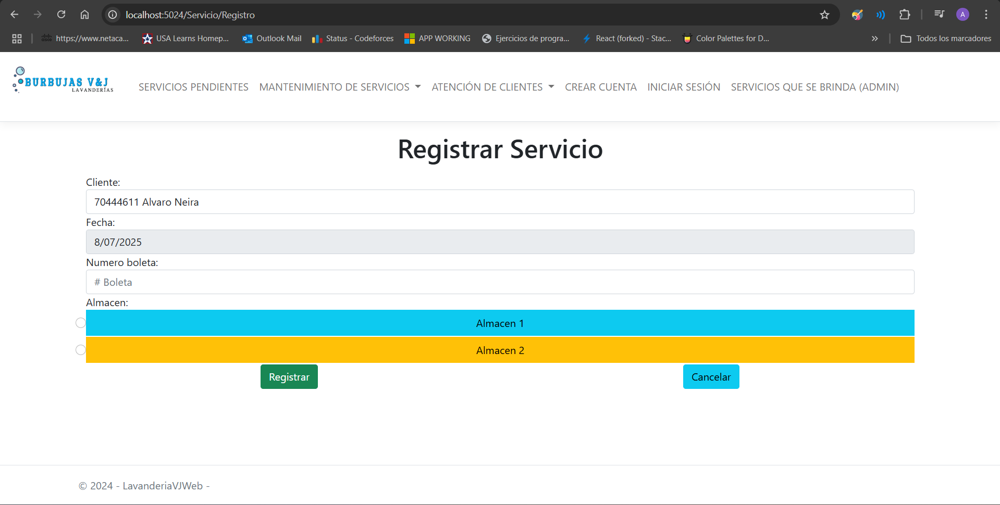
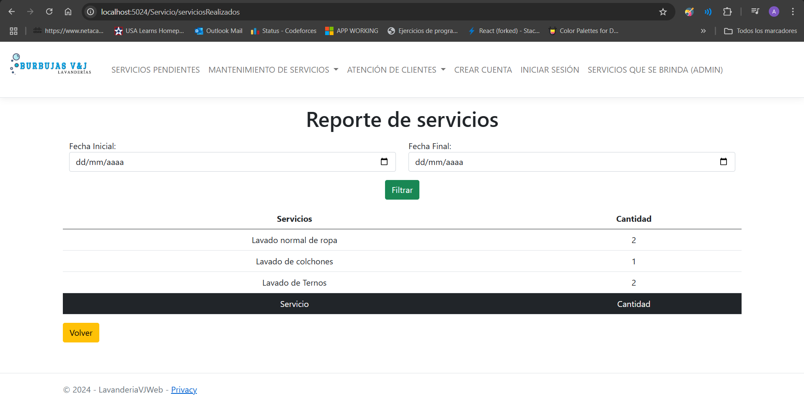
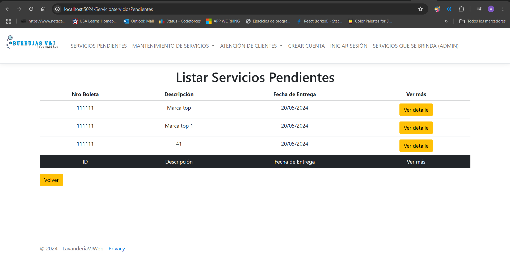

#  🚀 Proyecto - Gestión de lavandería
- En este proyecto desarrollé una página web responsive para la gestión de una lavandería. 
---

#	🎯 Objetivo
- Registrar empleados y clientes ( CRUD )
- Registrar servicios ( CRUD )
- Generar boletas de pago en pdf y descargar
- Enviar confirmación de pago y estado de lavado por email
- Registrar asistencia de empleado
- Gestonar descuentos 
  
---

#	💻 Tecnologías y comentarios
- Migración a .NET 8 (Fue realizado anteriormente con .net core 3.1)
- Se mejoraron y agregaron funcionalidades que antes no funcionaban
- Diseños Responsives
- Entity Framework
- SQL Server

---

# ✨ Pantallas

- Listar Servicios

- Registrar Servicios

- Reporte de Servicios

- Servicios Pendientes

